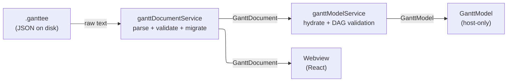
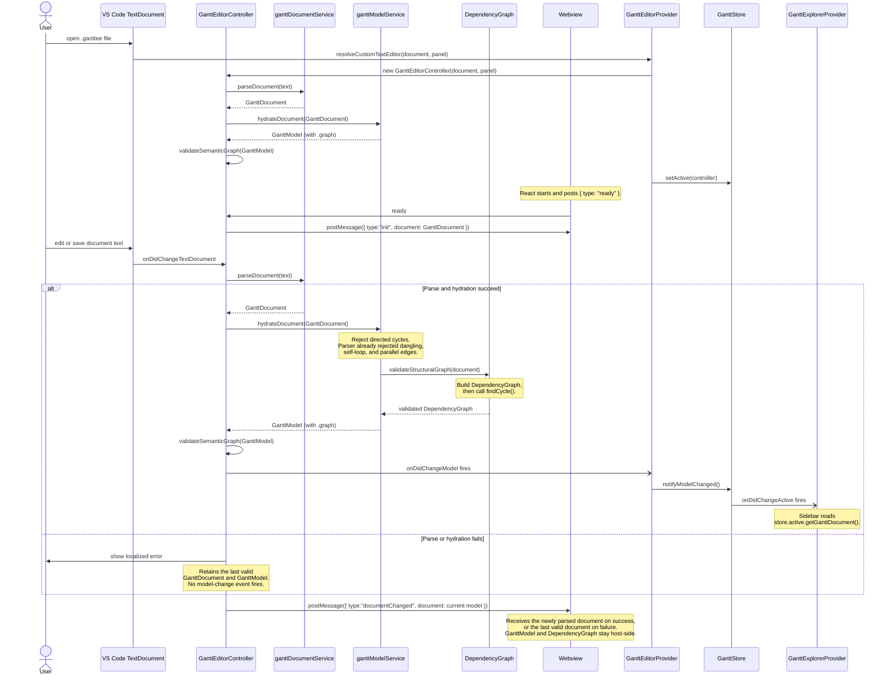
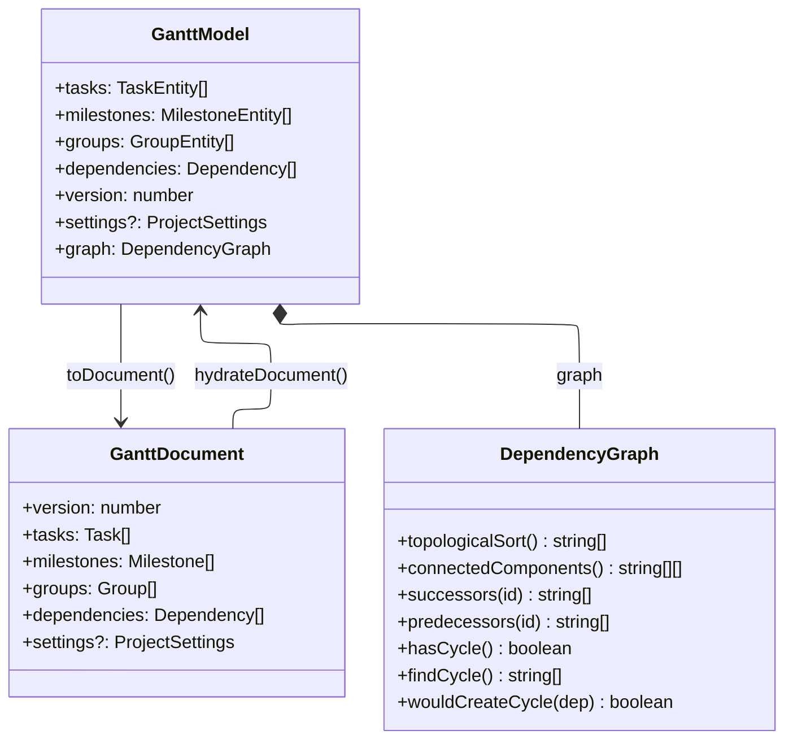

# GanttModel Hydration — Architecture Guide

Target audience: contributors working on the host-side data pipeline.

## Overview

A `.ganttee` file is plain JSON. Turning it into a rich, traversable in-memory
model involves three sequential transformations owned by three distinct modules.



The **`GanttDocument`** (plain objects, ISO date strings) is the wire format — it
is what lives on disk and what the webview receives over `postMessage`.
The **`GanttModel`** (`Date`-typed entity objects + `DependencyGraph`) is a
host-only computed view that is rebuilt on every reparse and never serialized.

---

## The Three Modules

### 1. `ganttDocumentService` — parse, validate, migrate

**File:** `src/services/ganttDocumentService.ts`

- Parses raw text with `JSON.parse`.
- Delegates to `ganttDocumentMigrationService` to upgrade older schema versions.
- Validates field types, allowed enum values, and required properties.
- Validates entity ids and dependency endpoints, self-loops, and parallel edges.
  Directed-cycle detection is deferred to hydration.
- Throws `GanttParseError` on invalid input.
- Output: `GanttDocument` — a plain, ISO-string record tree.

This module validates persisted ISO date strings but does not create `Date`
objects. It performs document-level structural checks but does not build a
`DependencyGraph` or run cycle detection.

### 2. `ganttModelService` — hydrate + structural DAG validation

**File:** `src/services/ganttModelService.ts`

- Converts every ISO date string into a `Date` and wraps each record in the
  appropriate entity class.
- Delegates structural validation to `validateStructuralGraph(document)` in
  `dependencyGraphService`.
- `validateStructuralGraph` checks endpoints, self-loops, and parallel edges;
  then creates a `DependencyGraph`, calls `findCycle()` on that instance, and
  returns the same validated graph for `GanttModel.graph`.
- `validateStructuralGraph` is the document-level structural validation entry
  point; no separate `validateGraph` wrapper exists.
- Throws typed errors (`SelfLoopDependencyError`, `ParallelEdgeDependencyError`,
  `CyclicDependencyError`) — a `GanttModel` is never returned for an invalid
  document.
- Also owns `toDocument(model)` for the reverse direction (serialization).

### 3. `DependencyGraph` — graph algorithms

**File:** `src/common/models/dependencyGraph.ts`

- Immutable adjacency-list structure built from entity ids and dependency records.
- Provides `topologicalSort`, `connectedComponents`, `successors`, `predecessors`,
  `hasCycle`, `findCycle`, `wouldCreateCycle`.
- Browser-safe: no `vscode` or Node imports, so the webview can import it for
  pre-flight validation without a separate bundle entry.
- Constructed by `dependencyGraphService` for plain-document validation,
  passed through `ganttModelService` into `GanttModel.graph`, and reused by
  downstream consumers (scheduling engine and graph validator).

---

## Sequence: file open, webview ready, and document change



---

## Data Model



---

## Why Two Containers (`GanttModel` + `DependencyGraph`)

`DependencyGraph` needs to be independently instantiable — without entity objects
and without a complete `GanttModel` — because callers need its algorithms before
or outside of a `GanttModel`:

| Caller                    | Needs graph algorithms                                    | Has a `GanttModel`? |
| ------------------------- | --------------------------------------------------------- | ------------------- |
| `dependencyGraphService`  | Creates the graph and calls `findCycle()` on raw input    | No                  |
| `hydrateDocument`         | Receives that validated graph before constructing a model | Not yet             |
| Future webview pre-flight | `wouldCreateCycle` on a candidate dependency              | Never               |

Putting the algorithms directly on `GanttModel` would force all three callers to
either hydrate a full model (expensive, potentially circular) or duplicate the
logic.

### What is shared between the two containers

`GanttModel.dependencies` keeps the original `Dependency[]` records (with `id`,
`type`, `sourceId`, `targetId`) because `toDocument` needs them for serialization.
`DependencyGraph` converts the same records into an adjacency-list
`Map<string, string[]>` for O(1) traversal — same source data, different
representation, different purpose.

Entity objects (`TaskEntity` etc.) are **not** inside `DependencyGraph`; only
their ids (plain strings) are stored as graph nodes.

---

## Layer Boundaries

```text
src/common/models/      ← pure types + DependencyGraph. No vscode, no Node, no DOM.
src/services/           ← pure logic. No vscode.
src/views/editor/       ← GanttEditorController. vscode only.
src/webview/            ← React UI. No vscode, no Node.
```

`GanttDocument` may cross any boundary (disk ↔ host ↔ webview).
`GanttModel` is host-only and must never be sent over `postMessage`.

Within `GanttEditorController`, `_document` is the cached plain
`GanttDocument`, while `_model` is the cached hydrated `GanttModel`.
`getGanttDocument()` exposes the plain document to host consumers, and
`hydratedModel` exposes the host-only model.

## Failure Behavior

The controller updates its cached `GanttDocument`, `GanttModel`, and semantic
validation result only after both parsing and hydration succeed. A malformed
document or structural graph failure shows a localized error and leaves the last
valid host state intact. The controller still sends a `documentChanged` message
after every observed text change, so a live webview remains synchronized with
that last valid state while the user repairs the file.
