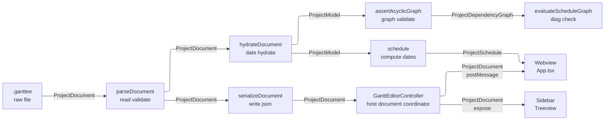
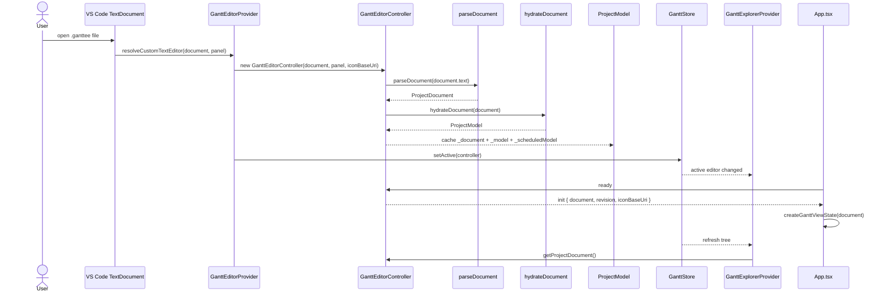
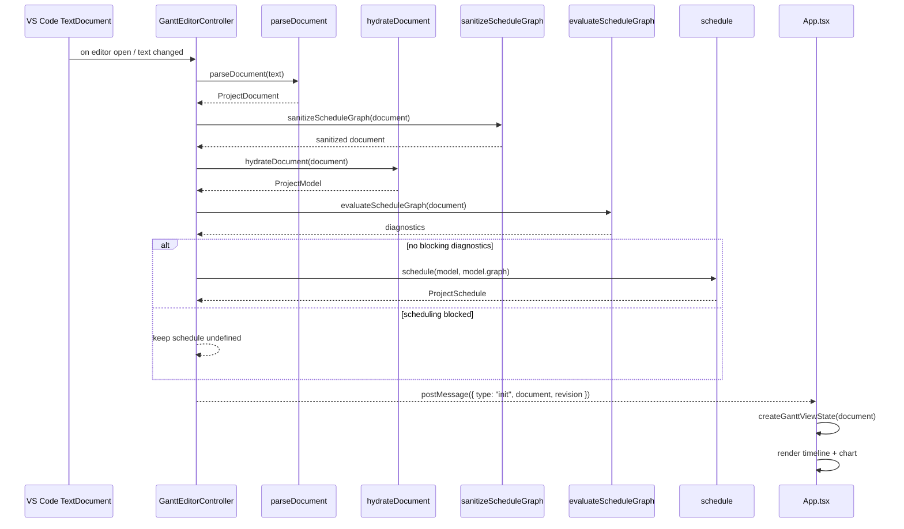
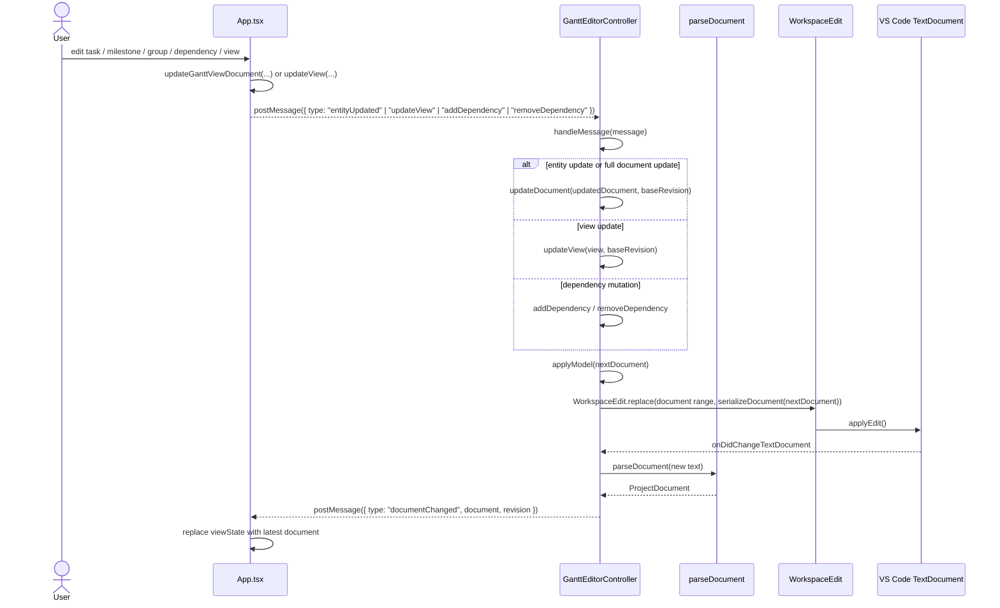
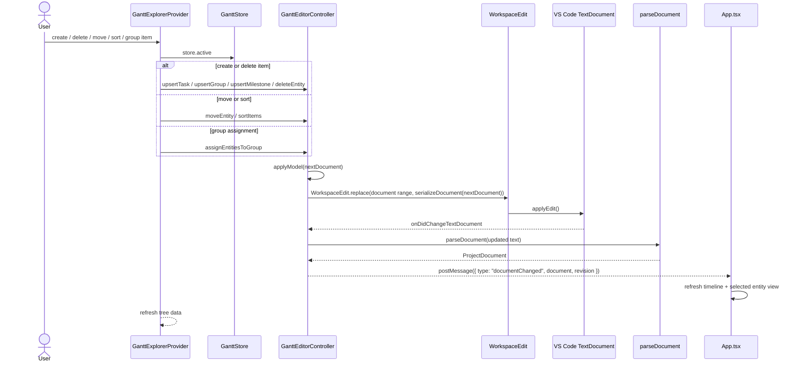
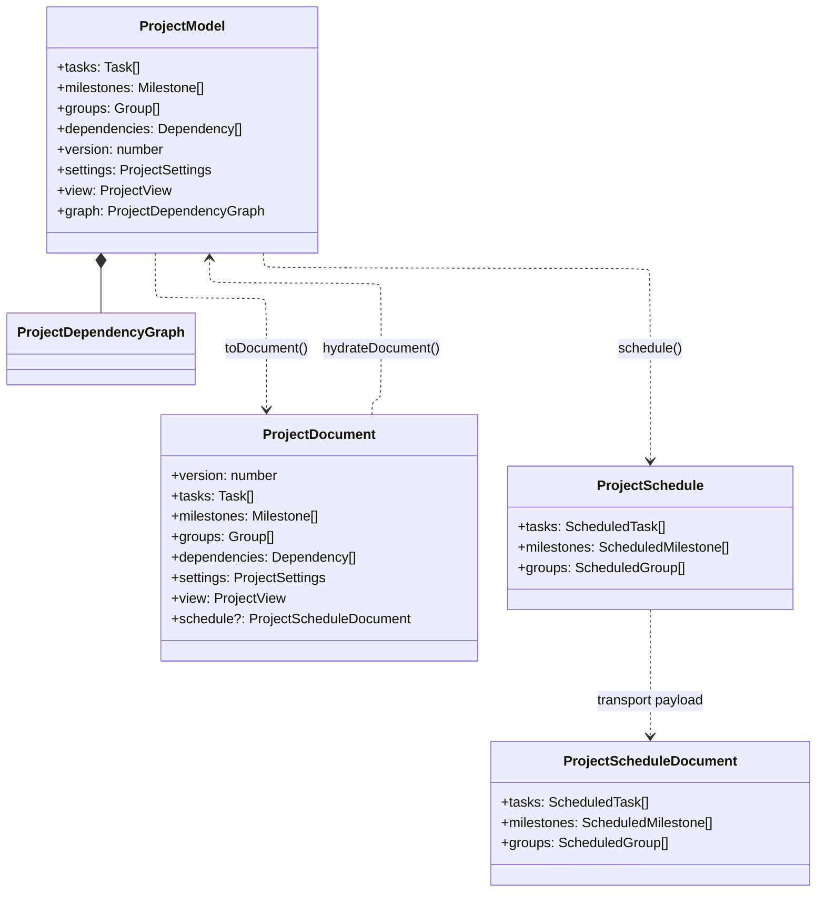

# ProjectDocument Hydration — Architecture Guide

Target audience: contributors working on the host-side data pipeline.

## Overview

A `.ganttee` file is plain JSON on disk. The host reads that text, validates it, and turns it into
an in-memory model before it can be rendered or mutated. In the current codebase, the persisted
shape is `ProjectDocument`, and the host-only hydrated shape is `ProjectModel`.



The `ProjectDocument` object is the persisted wire format. It is written to disk, sent to the
webview, and used as the source of truth for the host. The `ProjectModel` is a host-only computed
view built from that plain document and never serialized to the webview with `postMessage`.

---

## The Three Layers

### 1. `documentService` — parse, validate, migrate

**File:** `src/services/document/documentService.ts`

- Parses raw text with `JSON.parse`.
- Applies migration logic before validation.
- Validates document shape and cross-entity relations.
- Throws `GanttParseError` on malformed input.
- Returns `ProjectDocument`, which is plain data with ISO date strings and no `Date` objects.

This module is the boundary between raw file text and the persisted JSON shape. It does not build
`ProjectModel` objects or schedule state.

### 2. `projectModelService` — hydrate + DAG validation

**File:** `src/services/model/projectModelService.ts`

- Converts ISO date strings into `Date` instances.
- Wraps records in the `Task`, `Milestone`, and `Group` model classes.
- Runs dependency validation through `assertAcyclicGraph`.
- Throws typed errors for self-loops, parallel edges, or cycles.
- Returns a `ProjectModel` whose `.graph` is the host-side dependency graph.
- Also owns the reverse conversion through `toDocument(model)`.

The plain document is still the persisted object. The hydrated model is an in-memory host view built
from it on each reparse.

### 3. `DependencyGraph` — graph algorithms

**File:** `src/services/dependency-graph/dependencyGraphService.ts` and the model graph types under
`src/common/models/`

- Builds a graph from the plain dependency list.
- Checks for cycles and invalid graph structure.
- Supplies the algorithms used during validation and scheduling.
- Is host-owned and reusable for model-level logic, schedule evaluation, and graph sanitization.

This is not a separate document format. It is the graph algorithm substrate beneath the hydrated
model.

---

## Sequence: global host/webview flow



This is the top-level lifecycle: file text becomes `ProjectDocument`, then `ProjectModel`, then the
webview receives the plain document payload and the sidebar reads the same active document.

---

## Sequence 1: load to schedule and send to webview



The host recomputes schedule state on every successful reparse and sends the latest plain document
to the webview with its `revision` so the UI can render the most recent state.

---

## Sequence 2: webview edit flow to update the host document



The webview never writes the file directly. It sends a revision-safe payload to the host, and the
host validates and applies the document mutation through `WorkspaceEdit`.

---

## Sequence 3: sidebar edit flow to update the host document



The sidebar and the chart share the same host edit boundary. Both paths converge on
`GanttEditorController.applyModel`, which means there is still one persisted document and one
reparse cycle, no matter which UI surface initiated the mutation.

---

## Data Model



---

## Why the document and model are separate

`ProjectDocument` is stable and serializable. It is plain JSON and represents the file on disk and
what passes through the protocol. `ProjectModel` is the rich object graph used by host-side logic
and by scheduling. The document is the source of truth; the model is a computed view rebuilt on
every successful reparse.

The host also keeps a `ProjectSchedule` in `GanttEditorController` for the effective-date rendering,
which is why the controller sends a `schedule` payload along with the document during transport to
the webview.

---

## Layer boundaries

```text
src/common/documents/           ← persisted document types and plain JSON shapes.
src/common/models/              ← hydrated model classes and graph logic.

src/services/dependency-graph/  ← dependency validation, cycle checks, and graph primitives.
src/services/document/          ← parse, migrate, and validate the raw .ganttee document.
src/services/editing/           ← authoring edits and mutation helpers for project items.
src/services/groups/            ← group-specific delete/reparent logic and behaviors.
src/services/model/             ← hydrate/serialize between plain document and real model objects.
src/services/schedule/          ← scheduling evaluation, graph sanitization, and schedule derivation.
src/services/sidebar/           ← tree actions such as move, sort, and group assignment.

src/views/editor/               ← GanttEditorController and VS Code integration.
src/views/sidebar/              ← GanttExplorerProvider and tree commands.

src/webview/                    ← React chart/editor UI.
```

The plain document crosses host/webview boundaries. The hydrated model remains host-only and should
never be posted across the `postMessage` boundary. The webview receives `ProjectDocument` plus the
current `revision`, and it sends back authoring updates through the host protocol.

## Failure behavior

The controller updates its cached document and model only after parsing and hydration succeed. If a
malformed document or invalid graph appears, the host shows a localized error and keeps the last
valid state intact. A live webview still receives `documentChanged` from the last good state so the
UI stays synchronized while the user fixes the file.
