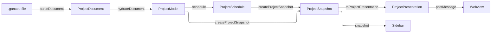
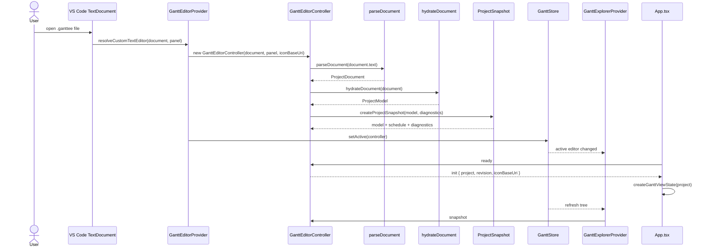
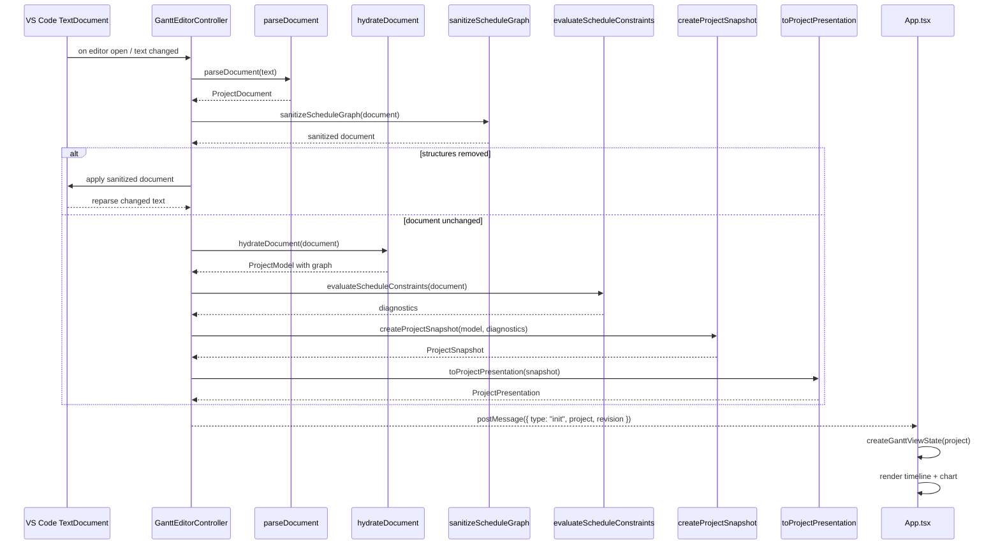
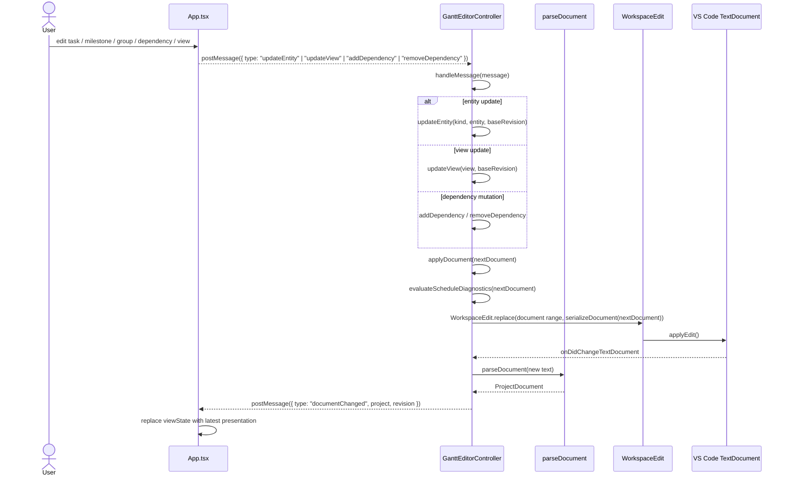
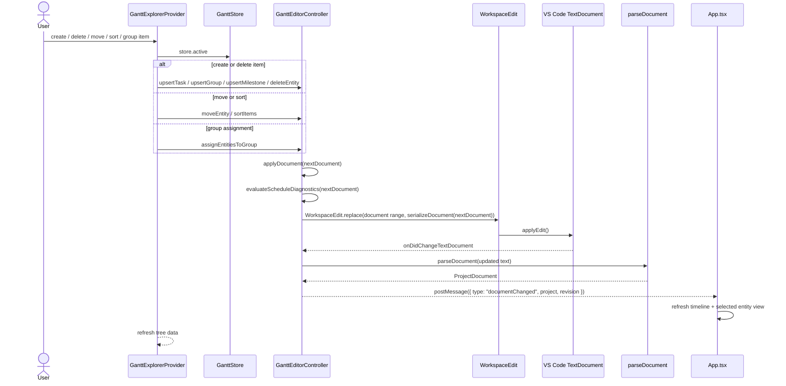
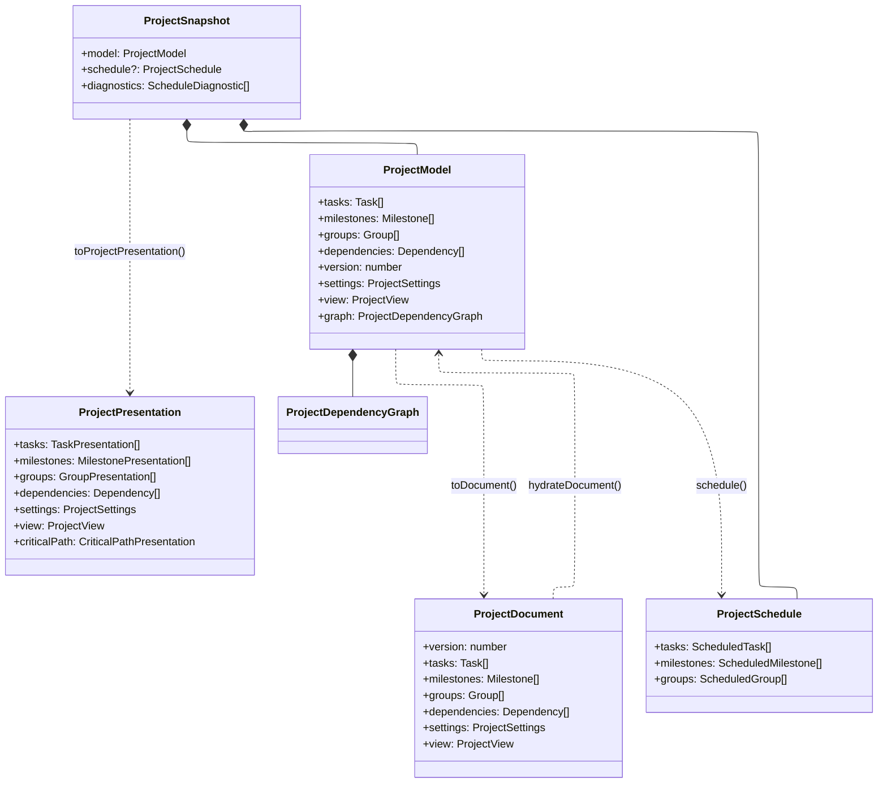

# ProjectDocument Hydration — Architecture Guide

Target audience: contributors working on the host-side data pipeline.

## Overview

A `.ganttee` file is plain JSON on disk. The host parses it into `ProjectDocument`, hydrates a
`ProjectModel`, computes a `ProjectSchedule`, and exposes both through an immutable
`ProjectSnapshot`. UI boundaries receive a versionless `ProjectPresentation`.



`ProjectDocument` is the persisted format and source of truth. `ProjectModel` is its hydrated
computational form. `ProjectSnapshot` hides model/schedule joining from host consumers.
`ProjectPresentation` is the JSON-compatible webview transport; it contains authored fields plus
optional effective schedule fields, but no disk schema version.

---

## The Three Layers

### 1. `documentService` — parse, validate, migrate

**File:** `src/services/document/documentService.ts`

- Parses raw text with `JSON.parse`.
- Applies migration logic before validation.
- Validates document shape and cross-entity relations.
- Throws `GanttParseError` on malformed input.
- Returns `ProjectDocument`, which is plain data with ISO date strings and no `Date` objects.

This module is the boundary between raw file text and the persisted JSON shape. It does not build
`ProjectModel` objects or schedule state.

### 2. `projectModelService` — hydrate + DAG validation

**File:** `src/services/model/projectModelService.ts`

- Converts ISO date strings into `Date` instances.
- Wraps records in the `Task`, `Milestone`, and `Group` model classes.
- Runs dependency validation through `assertAcyclicGraph`.
- Throws typed errors for self-loops, parallel edges, or cycles.
- Returns a `ProjectModel` whose `.graph` is the host-side dependency graph.
- Also owns the reverse conversion through `toDocument(model)`.

The plain document remains the persisted object. The hydrated model is rebuilt on each reparse and
is shared by host scheduling and presentation projection.

### 3. `DependencyGraph` — graph algorithms

**File:** `src/services/dependency-graph/dependencyGraphService.ts` and the model graph types under
`src/common/models/`

- Builds a graph from the plain dependency list.
- Checks for cycles and invalid graph structure.
- Supplies the algorithms used during validation and scheduling.
- Is host-owned and reusable for model-level logic, schedule evaluation, and graph sanitization.
- Stores dependency ids and types as edge attributes; endpoints are represented by graph topology.

This is not a separate document format. It is the graph algorithm substrate beneath the hydrated
model.

---

## Sequence: global host/webview flow



This is the top-level lifecycle: file text becomes `ProjectDocument`, `ProjectModel`, and
`ProjectSnapshot`. Sidebar reads the snapshot; webview receives its `ProjectPresentation`.

---

## Sequence 1: load to schedule and send to webview



Sanitization owns component-anchoring checks on reparse. Once sanitization reports no removals, the
controller evaluates only determinacy and endpoint constraints, avoiding a second component scan.
Snapshot creation schedules only when diagnostics permit it. The host sends a flattened presentation
with its `revision`; the webview performs no model hydration or graph computation.

---

## Sequence 2: webview edit flow to update the host document



The webview never writes the file or returns a complete project payload. It sends revision-safe
intent messages; the host applies them to the current document through `WorkspaceEdit`.

---

## Sequence 3: sidebar edit flow to update the host document



The sidebar and the chart share the same host edit boundary. Both paths converge on
`GanttEditorController.applyDocument`, which means there is still one persisted document and one
reparse cycle, no matter which UI surface initiated the mutation.

---

## Data Model



`ProjectDependencyGraph` stores only dependency id and type on each edge. Source and target ids are
derived from the edge topology. `schedule(model)` consumes `model.graph`; callers do not pass a
second graph that could disagree with the model.

---

## Why the document and model are separate

`ProjectDocument` is stable and serializable. It is plain JSON and represents the file on disk and
what passes through the protocol. `ProjectModel` is the rich object graph used by host-side logic
and by scheduling. The document is the source of truth; the model is a computed view rebuilt on
every successful reparse.

The controller stores one `ProjectSnapshot`. Sidebar reads its merged item records. The webview
receives a `ProjectPresentation` where each item carries optional `effective*` fields.

---

## Layer boundaries

```text
src/common/documents/           ← persisted document types and plain JSON shapes.
src/common/models/              ← hydrated model classes and graph logic.
src/common/presentation/        ← versionless JSON-safe UI projections.

src/services/dependency-graph/  ← dependency validation, cycle checks, and graph primitives.
src/services/document/          ← parse, migrate, and validate the raw .ganttee document.
src/services/editing/           ← authoring edits and mutation helpers for project items.
src/services/groups/            ← group-specific delete/reparent logic and behaviors.
src/services/model/             ← hydrate/serialize between plain document and real model objects.
src/services/schedule/          ← diagnostics, graph sanitization, and schedule derivation.
src/services/sidebar/           ← tree actions such as move, sort, and group assignment.

src/views/editor/               ← GanttEditorController and VS Code integration.
src/views/sidebar/              ← GanttExplorerProvider and tree commands.

src/webview/                    ← React chart/editor UI.
```

The plain document stays at the persistence boundary. Neither hydrated classes nor graph objects
cross `postMessage`. The webview receives `ProjectPresentation` plus the current protocol
`revision`, then sends authoring intents back to the host.

`evaluateScheduleDiagnostics` combines constraint and component-anchoring diagnostics for proposed
edits before persistence. Reparse uses `evaluateScheduleConstraints` because `sanitizeScheduleGraph`
has already checked and removed unanchored components.

## Failure behavior

The controller updates its cached document and model only after parsing and hydration succeed. If a
malformed document or invalid graph appears, the host shows a localized error and keeps the last
valid state intact. A live webview still receives `documentChanged` from the last good state so the
UI stays synchronized while the user fixes the file.
