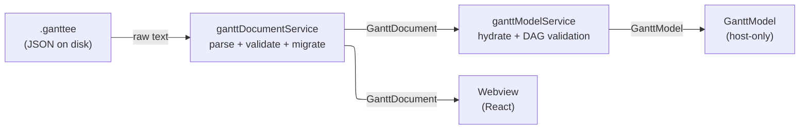
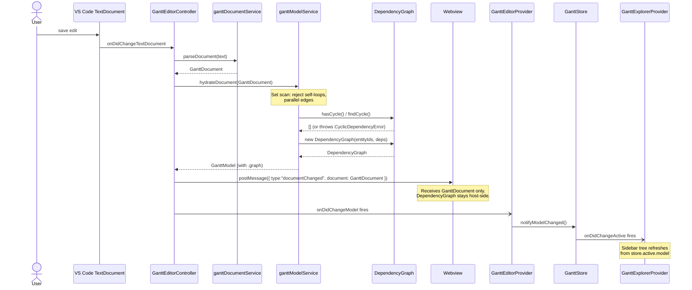
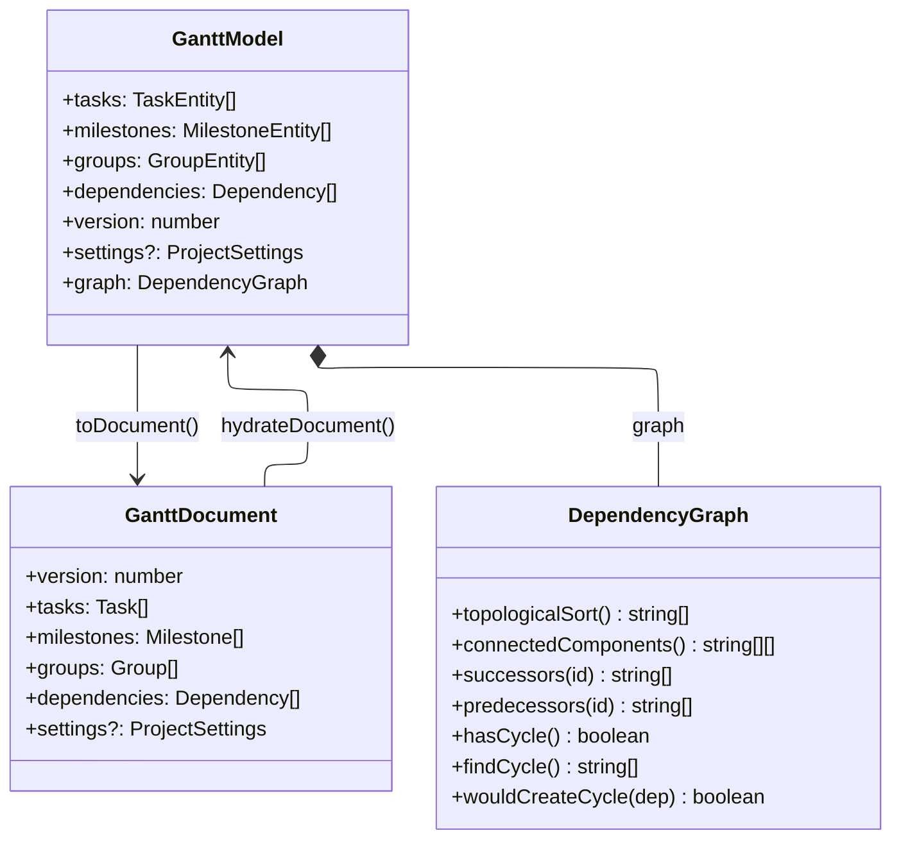

# GanttModel Hydration — Architecture Guide

Target audience: contributors working on the host-side data pipeline.

## Overview

A `.ganttee` file is plain JSON. Turning it into a rich, traversable in-memory
model involves three sequential transformations owned by three distinct modules.



The **`GanttDocument`** (plain objects, ISO date strings) is the wire format — it
is what lives on disk and what the webview receives over `postMessage`.
The **`GanttModel`** (`Date`-typed entity objects + `DependencyGraph`) is a
host-only computed view that is rebuilt on every reparse and never serialized.

---

## The Three Modules

### 1. `ganttDocumentService` — parse, validate, migrate

**File:** `src/services/ganttDocumentService.ts`

- Parses raw text with `JSON.parse`.
- Delegates to `ganttDocumentMigrationService` to upgrade older schema versions.
- Validates field types, allowed enum values, and required properties.
- Throws `GanttParseError` on invalid input.
- Output: `GanttDocument` — a plain, ISO-string record tree.

This module is **format-agnostic** about dates and has no knowledge of graph
structure.

### 2. `ganttModelService` — hydrate + structural DAG validation

**File:** `src/services/ganttModelService.ts`

- Converts every ISO date string into a `Date` and wraps each record in the
  appropriate entity class.
- Validates the dependency set for structural DAG invariants (self-loops,
  parallel edges, directed cycles) before the `GanttModel` is returned.
- Constructs a `DependencyGraph` and passes it into `GanttModel`.
- Throws typed errors (`SelfLoopDependencyError`, `ParallelEdgeDependencyError`,
  `CyclicDependencyError`) — a `GanttModel` is never returned for an invalid
  document.
- Also owns `toDocument(model)` for the reverse direction (serialization).

### 3. `DependencyGraph` — graph algorithms

**File:** `src/common/models/dependencyGraph.ts`

- Immutable adjacency-list structure built from entity ids and dependency records.
- Provides `topologicalSort`, `connectedComponents`, `successors`, `predecessors`,
  `hasCycle`, `findCycle`, `wouldCreateCycle`.
- Browser-safe: no `vscode` or Node imports, so the webview can import it for
  pre-flight validation without a separate bundle entry.
- Used in three contexts: inside `ganttModelService` during construction,
  inside `dependencyGraphService` for plain-document validation, and stored on
  `GanttModel.graph` for downstream consumers (scheduling engine, graph
  validator).

---

## Sequence: file open / document change



---

## Data Model



---

## Why Two Containers (`GanttModel` + `DependencyGraph`)

`DependencyGraph` needs to be independently instantiable — without entity objects
and without a complete `GanttModel` — because three callers construct one before
or outside of a `GanttModel`:

| Caller                    | Needs graph algorithms                              | Has a `GanttModel`? |
| ------------------------- | --------------------------------------------------- | ------------------- |
| `hydrateDocument`         | `hasCycle`/`findCycle` before the model is returned | Not yet             |
| `dependencyGraphService`  | cycle detection on a raw `GanttDocument`            | No                  |
| Future webview pre-flight | `wouldCreateCycle` on a candidate dependency        | Never               |

Putting the algorithms directly on `GanttModel` would force all three callers to
either hydrate a full model (expensive, potentially circular) or duplicate the
logic.

### What is shared between the two containers

`GanttModel.dependencies` keeps the original `Dependency[]` records (with `id`,
`type`, `sourceId`, `targetId`) because `toDocument` needs them for serialization.
`DependencyGraph` converts the same records into an adjacency-list
`Map<string, string[]>` for O(1) traversal — same source data, different
representation, different purpose.

Entity objects (`TaskEntity` etc.) are **not** inside `DependencyGraph`; only
their ids (plain strings) are stored as graph nodes.

---

## Layer Boundaries

```text
src/common/models/      ← pure types + DependencyGraph. No vscode, no Node, no DOM.
src/services/           ← pure logic. No vscode.
src/views/editor/       ← GanttEditorController. vscode only.
src/webview/            ← React UI. No vscode, no Node.
```

`GanttDocument` may cross any boundary (disk ↔ host ↔ webview).
`GanttModel` is host-only and must never be sent over `postMessage`.
