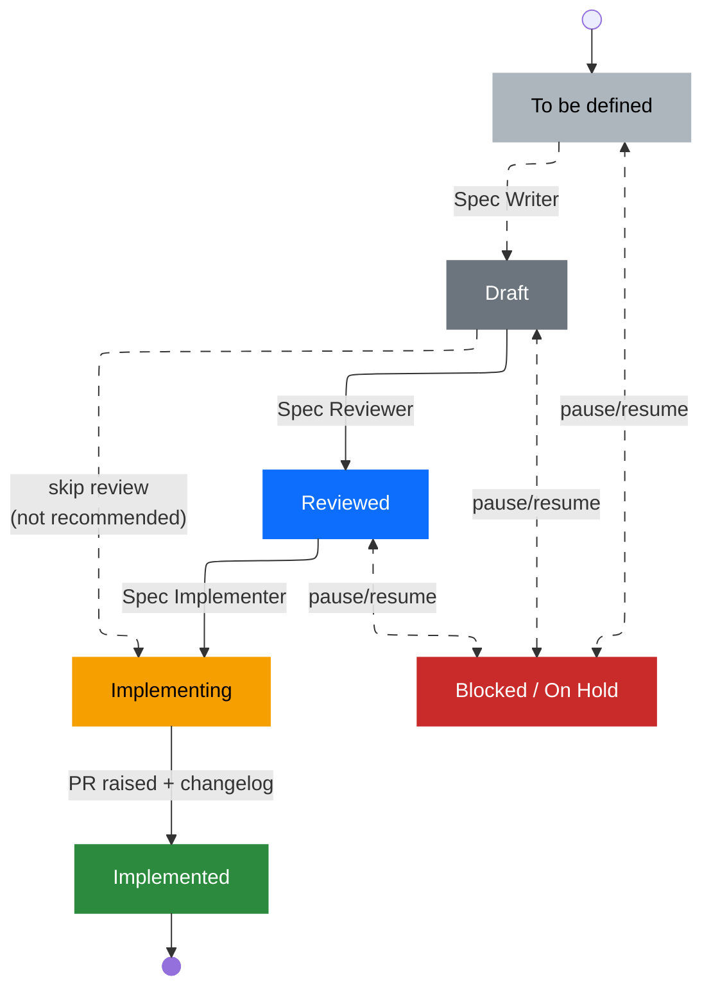

# Spec Workflow

How a Ganttee feature moves from an idea to shipped code. Each status lives in
the spec's front matter and is mirrored by its badge and its
[roadmap](./ROADMAP.md) row. The badge markdown for each status is defined in
[the feature-spec guidelines](../../.github/instructions/feature-spec.instructions.md).

## Lifecycle

| Status        | Meaning                               | Owner / who acts             | Next                    |
| ------------- | ------------------------------------- | ---------------------------- | ----------------------- |
| To be defined | Idea on the roadmap; no spec file yet | General chat (brainstorming) | Draft                   |
| Draft         | Initial spec authored                 | **Spec Writer** agent        | Reviewed / Implementing |
| Reviewed      | Spec checked, ready to build          | **Spec Reviewer** agent      | Implementing            |
| Implementing  | Coding has started                    | **Spec Implementer** agent   | Implemented             |
| Implemented   | PR raised; changelog updated          | **Spec Implementer** agent   | —                       |

**Blocked** and **On Hold** are reversible side-states that can be set from any
status before **Implementing**, then returned to the prior status.

## Spec lifecycle diagram

## Who does what

- **To be defined → Draft.** No dedicated agent. Use general chat (the default
  agent) in brainstorming mode to explore the problem, its users, and rough
  requirements, then hand the notes to the **Spec Writer**.
- **Draft.** The **_Spec Writer_** turns the idea into an implementation-ready
  spec and adds or updates its roadmap row.
- **Reviewed** (optional, highly recommended). The **_Spec Reviewer_** checks the spec and, once you
  confirm, promotes it. Draft specs may skip straight to Implementing.
- **Implementing.** The **_Spec Implementer_** sets this status when you approve
  its plan, then writes the code and tests.
- **Implemented.** The **_Spec Implementer_** sets this when the PR is raised and
  adds a `CHANGELOG.md` entry under `## [Unreleased]`.

Every status change updates the spec (front matter + badge) and the roadmap
(Status + Badge column) together. The
[release-readiness](../../.github/skills/release-readiness/SKILL.md) gate checks
the changelog entry before merge.
