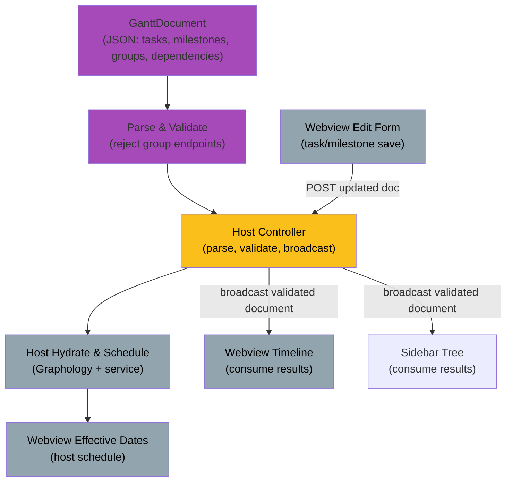

# Feature: Scheduling Computation Engine (effective dates & rollup)


<!-- AGENT NOTE: Keep this badge synced with front matter Status.
Canonical status-to-badge mapping is defined in
.github/instructions/feature-spec.instructions.md (Rules section). -->

## 1. Summary

Compute `effectiveStart`, `effectiveEnd`, and `effectiveDuration` for all scheduled entities (tasks,
milestones, groups) via single-pass topological constraint propagation (O(V+E)) over a dependency
graph containing only tasks and milestones, followed by post-order group rollup. The graph substrate
is Graphology; groups are excluded from graph nodes (they have no dependencies and are computed
post-order from member effective dates). The host executes scheduling and broadcasts the transient
result to the webview and sidebar. The pure scheduling service remains importable by future CLI and
MCP consumers. Prerequisite: graph-validation spec (which validates determinacy, cycles, anchors,
and duplicate endpoints, rejecting group dependency endpoints before hydration).

## 2. Goals / Non-goals

### Goals

- Single-pass topological propagation computing `Schedulable` accessors on tasks and milestones. For
  every dependency, the source is the constrained successor: `source startAfter target`,
  `source startWith target`, and `source endWith target`.
- Correct aggregation for multiple same-type incoming constraints (`max` for start-type constraints,
  `max` for end-type constraints, independent).
- Working-interval date arithmetic: use UTC `Date` values, configured working hours, configured days
  off, and fractional working-day precision without rounding.
- Post-order group rollup (separate from graph scheduling): `effectiveStart` = min of descendants;
  `effectiveEnd` = max of descendants.
- Epoch-millisecond internal representation; parse each input date once and normalize effective
  values to UTC working intervals.
- Pure service in `src/services/` (no `vscode`), importable by both host and webview, unit-testable.
- Graphology as the graph substrate: immutable, browser-safe, enables future incremental scheduling
  optimization.
- Host-computed scheduling after every accepted document change, so all consumers use one canonical
  effective schedule.

### Non-goals

- Structural validation (graph cycles, self-loops, parallel edges — see graph-validation spec;
  structural failures thrown at hydration).
- Semantic validation (determinacy, anchor detection, duplicate-endpoint reporting — see
  graph-validation spec and constraint-endpoint-rules.md).
- Resolution of under-constrained items. Validation marks them as errors before scheduling, so the
  scheduling service aborts if one is received.
- Rendering beyond consuming effective values.
- Optimistic local scheduling in the webview. The webview receives the host-computed schedule after
  an edit and does not call the scheduling service.

## 3. User Stories

- As a planner, I want dependent tasks to shift automatically when a predecessor moves, so that the
  chart stays consistent.
- As a planner, I want group bars to span their contents, so that rollups are accurate.
- As a planner, I want the timeline, forms, and sidebar to show the same computed effective dates.
- As a planner, I want fractional durations to respect my working hours and days off, so that
  effective dates match the project calendar.

## 4. Acceptance Criteria

- Given a task with a static `start` and `duration` (no dependencies) When scheduled Then
  `effectiveStart` is the UTC working-day start on `start` and `effectiveEnd` is computed by
  consuming exactly `duration` working days.

- Given a task with `start` on Tuesday at 08:30 UTC, an eight-hour working day, no days off, and a
  duration of `2` When scheduled Then `effectiveEnd` is Wednesday at 16:30 UTC.

- Given no working-time settings in the document When scheduling is requested Then `workingDayStart`
  defaults to 09:00 UTC, `workingDayHours` defaults to `8`, and an omitted or empty `daysOff` list
  treats every day as working.

- Given a task ending Friday with a 1 working-day `startAfter` successor When scheduled Then
  successor's `effectiveStart` is the next working-day start, skipping configured days off.

- Given a task (source) with two `startAfter` dependencies to targets ending on different days When
  scheduled Then `effectiveStart` equals the later end, regardless of processing order.

- Given a task defined by `end` and `duration` (end-anchored) When scheduled Then `effectiveStart`
  is computed by consuming `duration` working days backward from `effectiveEnd`, skipping configured
  days off.

- Given a milestone with a `startAfter` dependency When scheduled Then
  `effectiveStart = effectiveEnd = target.effectiveEnd` (milestone aliases both endpoints to its
  date).

- Given a task defined by both `start` and `end` (duration derived) When scheduled Then
  `effectiveDuration = effectiveEnd − effectiveStart`.

- Given a task whose effective start is inside a working interval When its end is computed from a
  fractional duration Then traversal consumes the remaining time in that interval before consuming
  later working intervals.

- Given an eight-hour working interval from 09:30 to 17:30 UTC, a task starting Tuesday at 14:30
  UTC, and a duration of `2.5` working days When scheduled Then the task ends Friday at 10:30 UTC
  after consuming only working time.

- Given a static or dependency-derived timestamp before a working interval, after its end, or on a
  configured day off When the timestamp is normalized Then it moves to the current working-day
  start, the next working-day start, or the next working-day start respectively.

- Given a `startWith` or `endWith` dependency When the dependency endpoint is resolved Then the
  source preserves the target's effective timestamp without applying a working-day offset.

- Given a task with a zero duration When the document is validated or scheduled Then the task is
  rejected as invalid; milestone duration remains zero.

- Given a valid dependency graph (tasks + milestones only, no groups) When scheduled Then all
  schedulable vertices receive effective values in a single topological pass.

- Given a task or milestone marked as under-constrained by validation When scheduling is requested
  Then the scheduling service raises a scheduling error and returns no partial schedule.

- Given an input whose effective start is after its effective end When scheduling is requested Then
  the scheduling service raises a scheduling error and returns no partial schedule.

- Given a group containing tasks and milestones with computed effective dates When rolled up Then
  group's `effectiveStart` = minimum of all member `effectiveStart` values and group's
  `effectiveEnd` = maximum of all member `effectiveEnd` values.

- Given an empty group or a group whose children have no effective dates When rolled up Then the
  group's effective start and end are undefined, the group is omitted from parent rollups, and the
  group is omitted from chart display.

- Given a task or milestone edit When the host accepts the updated document Then the host computes
  and broadcasts the updated effective schedule to the webview and sidebar.

- Given multiple dependency candidates for the same endpoint When scheduling is requested Then the
  service selects the maximum UTC timestamp independently for each constrained endpoint.

### Over-constraint resolution fallback (per constraint-endpoint-rules.md)

- When multiple dependencies constrain the same endpoint: use `max` of all computed dates.
- When a static value conflicts with a dependency on the same endpoint: the dependency takes
  precedence, per endpoint-specific rules in constraint-endpoint-rules.md.
- A task without a static `duration` may infer it from `effectiveStart` and `effectiveEnd` when both
  are available. If duration cannot be inferred, the scheduling service uses a default duration of
  `1` working day only when the item is otherwise schedulable. Under-constrained input is rejected
  by validation and causes scheduling to abort if received.

## 5. Domain & Data Model Impact

### Graph Structure and Graphology

The dependency graph is instantiated using Graphology [graphology](https://graphology.github.io/)
and contains **only tasks and milestones as nodes**. Groups are **excluded**: they carry no
dependencies and are computed via post-order rollup from member effective dates. This simplifies
algorithm application (no filtering of ineligible nodes) and clarifies the graph's role:
dependency-driven scheduling only.

**Flow**:



- **`schedulingService.ts`** (pure, no `vscode`):
  - `schedule(model: GanttModel, graph: Graphology): ScheduledModel` — executes topological
    propagation (tasks + milestones).
  - `rollupGroupSchedules(groups: Group[], scheduledModel: ScheduledModel): GroupWithEffective[]` —
    derives group effective dates post-order.
  - The host imports and calls this service after parsing and validating the document.
  - The webview consumes the serialized schedule and does not call this service.

- **Working-time arithmetic**: The service uses UTC `Date` objects for effective values and epoch
  milliseconds for arithmetic and comparisons. It reads (absolute paths)
  `settings.workingCalendar.daysOff`, `settings.workingDayHours` (default `8`), and
  `settings.workingDayStart` (default `9`). An omitted or empty `daysOff` list means every day is
  working. Working-time traversal skips non-working intervals and preserves fractional precision.

#### Working-time convention and schema

Document version is already 2 (per prior spec); these settings add to the existing version-2
structure without requiring a new version bump.

- Effective values use `effectiveStart`, `effectiveEnd`, and `effectiveDuration`. Persisted task
  inputs remain `start`, `end`, and `duration`; effective values are computed in memory and are not
  written to the `.ganttee` file.
- Working-time settings are stored in the document root at the paths shown below:

  ```jsonc
  {
    "version": 2,
    "settings": {
      "workingCalendar": { "daysOff": [] },
      "workingDayHours": 8.0,
      "workingDayStart": 9.0,
    },
    "tasks": [/* ... */],
    "milestones": [/* ... */],
    "groups": [/* ... */],
    "dependencies": [/* ... */],
  }
  ```

- `workingDayStart` is decimal hours in `[0, 24)`. For example, `8.5` means 08:30 UTC. Its default
  is `9.0`.
- `workingDayHours` is positive and no greater than 24. Its default is `8.0`.
- `daysOff` contains ISO weekday numbers (`1` = Monday, `7` = Sunday). An omitted or empty list
  means every day is working.
- All timestamps and working-day boundaries use UTC. Effective dates are UTC date-times represented
  as JavaScript `Date` objects during scheduling. Date- only inputs are interpreted at `00:00:00Z`.
- The implementation may use `Temporal.Instant` and `Temporal.ZonedDateTime` with UTC, with a
  compatible polyfill when needed. The arithmetic layer must expose epoch milliseconds to the
  scheduling service.
- A working interval starts at `workingDayStart` and ends at `workingDayStart + workingDayHours` on
  a working date.
- A duration is measured in working days. A fractional part consumes the same fraction of
  `workingDayHours`. Traversal consumes only working-interval time and skips `daysOff`.
- A two-working-day task starting Tuesday at 08:30 UTC with an eight-hour working day ends Wednesday
  at 16:30 UTC.
- A start inside a working interval consumes the remaining time in that interval before later full
  intervals. For example, with an interval from 09:30 to 17:30, a Tuesday 14:30 start and a duration
  of `2.5` working days ends Friday at 10:30 UTC.
- A timestamp before its working interval is normalized to that day's start. A timestamp at or after
  the interval end, or on a day off, is normalized to the next working-day start. A timestamp inside
  the interval is preserved. Static inputs remain unchanged; only effective values are normalized.
- For `source startAfter target`, the candidate start is `target.effectiveEnd` when it is inside the
  working interval; otherwise it is the next working-day start. `source startWith target` uses the
  target's effective start, and `source endWith target` uses the target's effective end.
- Multiple dependency candidates use the maximum UTC timestamp independently for each constrained
  endpoint. The complementary endpoint is computed by working-time traversal and the entity's
  effective duration.
- A zero-duration task is invalid. Milestones remain zero-duration.

### Type Definitions

- **`GanttDocument`**: The plain JSON-compatible authoring document exchanged by host and webview.
  Its transient `schedule` field contains `ScheduledTask`, `ScheduledMilestone`, and
  `ScheduledGroup` records with ISO timestamps; the field is omitted from disk serialization.
- **`GanttModel`**: The parsed, validated authoring model containing `Date` values. Derived by the
  host from the `.ganttee` TextDocument.
- **`ScheduledModel`**: The in-memory result of scheduling, with all tasks and milestones bearing
  `effectiveStart`, `effectiveEnd`, and `effectiveDuration` fields (in addition to persisted
  inputs). Its group projections are `ScheduledGroupEntity` values with `Date` fields.
- **`Schedulable` accessors**: Computed properties on tasks and milestones that return their
  effective start/end dates and duration, with type narrowing to exclude groups (which are not
  schedulable in the graph).
- **Graph instantiation**: Refactored from custom `DependencyGraph` to Graphology factory in
  `dependencyGraphService.ts`. Excludes groups from node set (only tasks + milestones); validates
  cycles, self-loops, and parallel edges on the filtered graph. Used by host hydration for
  scheduling.

- **Host scheduling** (nominal case): After parsing and validation, the host hydrates a
  `GanttModel`, calls `schedulingService`, and adds the serialized schedule to the transient
  `GanttDocument` sent to consumers.

- **Host validation and scheduling**: Host parses, validates, hydrates, and schedules the document.
  It never persists effective values. It broadcasts the accepted authoring document and transient
  schedule to all consumers. The host result replaces any webview state after every update.

## 6. Protocol Impact

`src/common/protocol.ts`:

- `init` and `documentChanged` messages include a `GanttDocument` with its transient serialized
  schedule.
- Webview→Host POST: `{ type: "entityUpdated", updatedDocument: GanttDocument }` contains authoring
  data only; the webview does not send a schedule.
- The host re-parses, validates, hydrates, and schedules accepted updates. The host rejects stale
  posts, and its current document and schedule always win a concurrent update.
- Host→Webview correction (deferred to future spec): if multi-source scheduling is introduced, host
  may verify and broadcast corrected state.

**Serialization**: Effective date values are held as UTC `Date` objects in `GanttModel` and
`ScheduledModel`. Protocol `GanttDocument` schedule entries use ISO timestamps. The schedule is
never written to the `.ganttee` file.

## 7. UX

- **Timeline (ECharts)**: bars drawn from effective dates; group bars span descendants; milestones
  positioned at their `effectiveStart`.
- **Sidebar tree**: shows effective dates on each item; groups show rollup dates.
- **Edit form**: task/milestone form displays effective dates from the host schedule after save.
- **Validation badges**: host-side validation results (under-constrained, over-constrained,
  duplicate endpoint) displayed on sidebar items. Badge labels are new user-facing strings and
  require localization via `vscode.l10n.t()`.

Design rationale: Value Flow (one computed schedule) · Principle (host authority ensures
consistency) · Move (host broadcasts the canonical schedule to all views).

## 8. Test Strategy

- **Unit (services)**:
  - `schedulingService`: golden fixtures — linear chains, diamonds (multi-incoming `max`),
    end-anchored tasks, milestones, working-interval traversal, configured days off, default
    settings, UTC boundaries, fractional starts, fractional durations, reverse traversal, boundary
    normalization, `startWith`/`endWith`timestamp preservation, zero-duration rejection, constraint
    conflict resolution, and ordering independence of`max` aggregation.
  - `rollupGroupSchedules`: group hierarchy, nested groups, empty groups, single child, multiple
    children with different start/end dates.
  - Graphology instantiation: nodes include only task + milestone ids; groups excluded; cycle
    detection works on filtered graph.

- **Integration**:
  - The pure service can be invoked from host-side code and produces expected effective values
    (compare to golden output), without requiring `vscode`.
  - Host hydration and scheduling produce a serialized schedule that round-trips to Date-based
    runtime values in the webview.

- **Webview form interaction**:
  - Task/milestone save → webview posts the authored document to the host.
  - Host validates and schedules → broadcasts the document and transient schedule.
  - A host document change supersedes a concurrent webview update and the webview replaces its
    schedule with the canonical host schedule.

- **E2E**:
  - Edit task in webview form → save → POST to host → host validates and schedules → sidebar,
    timeline, and form consume the updated document and schedule.
  - Dependency change shows immediate cascading effect in webview; sidebar updates on host
    broadcast.

- **Coverage**: branch coverage ≥ 90% per dependency type, rollup path, and Graphology instantiation
  path.

## 9. Risks & Open Questions

- 🟡 Medium — Risk: Graphology API mismatch with scheduling algorithm patterns (topological sort,
  cycle detection). **Mitigation**: prototype topological + cycle detection on Graphology before
  full implementation; API is mature and well-tested.

- 🟡 Medium — Risk: webview bundle size (Graphology + `schedulingService`). **Mitigation**:
  tree-shake unused Graphology standard-library functions; measure delta; acceptable for a
  specialized graph editor (estimated +50–100 KB).

- 🟡 Medium — Risk: invalid input reaches the scheduling service despite validation. **Treatment**:
  constraint-endpoint-rules.md rejects negative derived duration; the service raises a scheduling
  error and aborts rather than clamping.

- 🟢 Low — Clarification: fractional working-day arithmetic is defined inline in §5. Effective
  values use UTC `Date` objects, working intervals use configured `daysOff`, `workingDayHours`
  defaults to `8`, and `workingDayStart` defaults to `9`. Static inputs remain unchanged; effective
  values are normalized for scheduling. No configurable timezone is stored.

- 🟢 Low — Risk: webview scheduling correctness (single implementation). **Mitigation**: shared pure
  service; unit tests; the service is available to the host for future verification without making
  the host authoritative in this phase.

- 🟢 Low — Open question: recompute granularity — full recompute per edit (simple, recommended for
  this phase) or incremental dirty-subtree optimization (Graphology node attributes enable this).
  **Treatment**: incremental dirty-subtree optimization deferred to future spec

- 🟢 Low — Clarification: this phase webview-only scheduling (no host re-compute). **Treatment**:
  Host verification will be introduced only when CLI/MCP scheduling exists. This keeps the phase
  simple and avoids redundant computation.

## 10. Review Outcome

**Review completed**: 2026-08-30

**Findings summary**:

1. **Badge URL** — Fixed typo: `style=for-the-fade` → `style=for-the-badge` to match feature-spec
   badge mapping.
2. **Schema version clarity** — Added explicit statement: document version is already 2;
   working-time settings add to the existing structure without a new version bump.
3. **Schema path documentation** — Updated all path references to use full document paths (e.g.,
   `root.settings.workingDayHours`); expanded jsonc example to show complete document structure.
4. **Type definitions** — Added new subsection in Domain & Data Model defining `GanttModel`,
   `ScheduledModel`, and `Schedulable` accessors.
5. **Localization note** — Added clarification in §7 UX that validation badge labels are new
   user-facing strings requiring localization via `vscode.l10n.t()`.

**All issues resolved.** The spec is implementation-ready.
