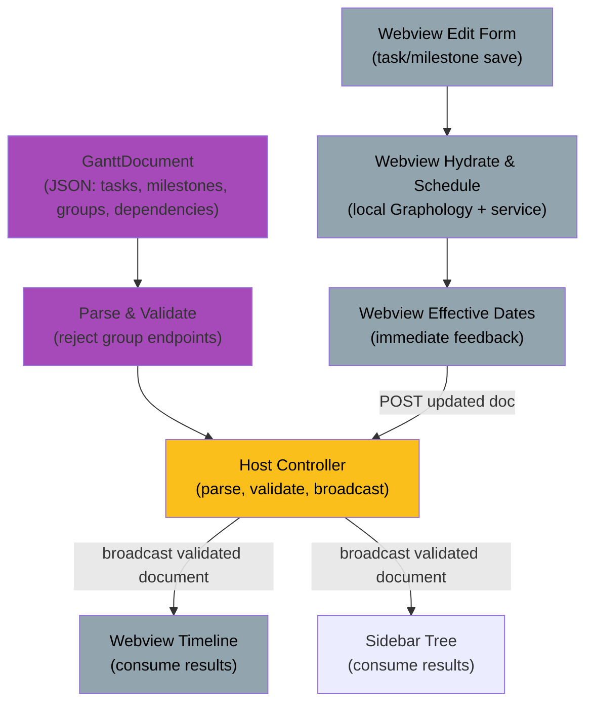

# Feature: Scheduling Computation Engine (effective dates & rollup)

<!-- AGENT NOTE: Keep this badge synced with front matter Status.
Canonical status-to-badge mapping is defined in
.github/instructions/feature-spec.instructions.md (Rules section). -->

## 1. Summary

Compute `effectiveStart`, `effectiveEnd`, and `effectiveDuration` for all
scheduled entities (tasks, milestones, groups) via single-pass topological
constraint propagation (O(V+E)) over a dependency graph containing only tasks
and milestones, followed by post-order group rollup. The graph substrate is
Graphology; groups are excluded from graph nodes (they have no dependencies and
are computed post-order from member effective dates). During Phases 1–3, the
webview is the only runtime that executes scheduling. The pure scheduling
service remains importable by the host for future verification and other
host-side consumers, but the host does not schedule or persist effective values
in this phase. Prerequisite: graph-validation spec (which validates
determinacy, cycles, anchors, and duplicate endpoints, rejecting group
dependency endpoints before hydration).

## 2. Goals / Non-goals

### Goals

- Single-pass topological propagation computing `Schedulable` accessors on tasks
  and milestones. For every dependency, the source is the constrained
  successor: `source startAfter target`, `source startWith target`, and `source
endWith target`.
- Correct aggregation for multiple same-type incoming constraints (`max` for
  start-type constraints, `max` for end-type constraints, independent).
- Working-day date arithmetic: skip weekends, support fractional working days,
  retain precision (no rounding).
- Post-order group rollup (separate from graph scheduling): `effectiveStart` =
  min of descendants; `effectiveEnd` = max of descendants.
- Epoch-day internal representation; single ISO parse pass.
- Pure service in `src/services/` (no `vscode`), importable by both host and
  webview, unit-testable.
- Graphology as the graph substrate: immutable, browser-safe, enables future
  incremental scheduling optimization.
- Webview-computed scheduling on task/milestone save: immediate effective-date
  feedback in forms without host round-trip.

### Non-goals

- Structural validation (graph cycles, self-loops, parallel edges — see
  graph-validation spec; structural failures thrown at hydration).
- Semantic validation (determinacy, anchor detection, duplicate-endpoint
  reporting — see graph-validation spec and constraint-endpoint-rules.md).
- Resolution of under-constrained items. Validation marks them as errors before
  scheduling, so the scheduling service aborts if one is received.
- Rendering beyond consuming effective values.
- Host verification or re-scheduling on webview save. The pure service remains
  host-compatible for future verification, CLI, or MCP use; those consumers are
  deferred to future specifications.

## 3. User Stories

- As a planner, I want dependent tasks to shift automatically when a predecessor
  moves, so that the chart stays consistent.
- As a planner, I want group bars to span their contents, so that rollups are
  accurate.
- As a planner, I want immediate feedback when I save a task edit, including
  computed effective dates, without waiting for a host round-trip.

## 4. Acceptance Criteria

- Given a task with a static `start` and `duration` (no dependencies)
  When scheduled
  Then `effectiveEnd = start + duration` in working days (weekends skipped).

- Given a task ending Friday with a 1 working-day `startAfter` successor
  When scheduled
  Then successor's `effectiveStart` is the following Monday.

- Given a task (source) with two `startAfter` dependencies to targets ending on
  different days
  When scheduled
  Then `effectiveStart` equals the later end, regardless of processing order.

- Given a task defined by `end` and `duration` (end-anchored)
  When scheduled
  Then `effectiveStart = effectiveEnd − duration` in working days.

- Given a milestone with a `startAfter` dependency
  When scheduled
  Then `effectiveStart = effectiveEnd = target.effectiveEnd` (milestone aliases
  both endpoints to its date).

- Given a task defined by both `start` and `end` (duration derived)
  When scheduled
  Then `effectiveDuration = effectiveEnd − effectiveStart`.

- Given a valid dependency graph (tasks + milestones only, no groups)
  When scheduled
  Then all schedulable vertices receive effective values in a single topological
  pass.

- Given a task or milestone marked as under-constrained by validation
  When scheduling is requested
  Then the scheduling service raises a scheduling error and returns no partial
  schedule.

- Given a group containing tasks and milestones with computed effective dates
  When rolled up
  Then group's `effectiveStart` = minimum of all member `effectiveStart` values
  and group's `effectiveEnd` = maximum of all member `effectiveEnd` values.

- Given an empty group or a group whose children have no effective dates
  When rolled up
  Then the group's effective start and end are undefined, the group is omitted
  from parent rollups, and the group is omitted from chart display.

- Given a webview task/milestone edit form
  When the user saves the entity
  Then the webview computes and displays updated effective dates immediately
  (no host round-trip).

### Over-constraint resolution fallback (per constraint-endpoint-rules.md)

- When multiple dependencies constrain the same endpoint: use `max` of all
  computed dates.
- When a static value conflicts with a dependency on the same endpoint: the
  dependency takes precedence, per endpoint-specific rules in
  constraint-endpoint-rules.md.
- A task without a static `duration` may infer it from `effectiveStart` and
  `effectiveEnd` when both are available. If duration cannot be inferred, the
  scheduling service uses a default duration of `1` working day. This fallback
  resolves the missing duration for scheduling and is not persisted as a task
  value.

## 5. Domain & Data Model Impact

### Graph Structure and Graphology

The dependency graph is instantiated using Graphology [graphology](https://graphology.github.io/) and
contains **only tasks and milestones as nodes**. Groups are **excluded**: they carry no
dependencies and are computed via post-order rollup from member effective dates. This
simplifies algorithm application (no filtering of ineligible nodes) and clarifies the
graph's role: dependency-driven scheduling only.

**Flow**:

- **`schedulingService.ts`** (pure, no `vscode`):
  - `schedule(model: GanttModel, graph: Graphology): ScheduledModel` — executes
    topological propagation (tasks + milestones).
  - `rollupGroupSchedules(groups: Group[], scheduledModel: ScheduledModel):
GroupWithEffective[]` — derives group effective dates post-order.
  - Webview imports and calls this service on task/milestone save (Phases 1–3).
  - The host can import and call this service in the future, but does not call it
    during Phases 1–3.

- **Graph instantiation**: Refactored from custom `DependencyGraph` to Graphology
  factory in `dependencyGraphService.ts`. Excludes groups from node set (only
  tasks + milestones); validates cycles, self-loops, and parallel edges on the
  filtered graph. Used by webview hydration for scheduling.

- **Webview scheduling** (Phases 1–3, nominal case): On task/milestone form save,
  webview locally hydrates a Graphology instance and calls `schedulingService`.
  Effective dates display immediately in the form (no host round-trip). Webview
  then posts the updated authoring document to the host.

- **Host validation** (Phases 1–3): Host parses and validates the document
  (structure, determinacy, anchors). Host does NOT re-schedule or persist
  effective values. It broadcasts the accepted authoring document to all
  consumers (sidebar, tree, timeline). A host document update supersedes any
  local webview schedule; the webview discards stale local state.

## 6. Protocol Impact

`src/common/protocol.ts`:

- `init` message: includes initial document (no scheduling; document is source).
- `documentChanged` message: includes the authoring document after host
  validation. Effective values are derived model fields and are not serialized
  to disk.
- Webview→Host POST (new): `{ type: "entityUpdated", updatedDocument: GanttDocument }`
  — triggered by task/milestone form save; host re-parses and validates (does
  not re-schedule). The host rejects or ignores a stale post, and its current
  document always wins a concurrent update.
- Host→Webview broadcast: sends the validated authoring document to sidebar and
  tree for display. The webview derives effective values locally from that
  document.
- Host→Webview correction (future, Phase 4+): if multi-source scheduling is
  introduced, host may verify and broadcast corrected state.

**Serialization**: Effective date values are stored in the in-memory
`GanttDocument`/scheduled model as ISO-string-compatible values, but are not
written to the `.ganttee` file. The persisted document contains only authoring
data. The webview derives effective values after hydration and after local
edits adn scheduling; `Date` objects are webview-only during computation.

## 7. UX

- **Timeline (ECharts)**: bars drawn from effective dates; group bars span
  descendants; milestones positioned at their `effectiveStart`.
- **Sidebar tree**: shows effective dates on each item; groups show rollup
  dates.
- **Edit form**: task/milestone form displays effective dates immediately after
  save (webview-computed). No "waiting for host" delay.
- **Validation badges**: host-side validation results (under-constrained,
  over-constrained, duplicate endpoint) displayed on sidebar items.

Design rationale: Value Flow (computed schedule is immediate) · Principle
(webview scheduling feels responsive; host authority ensures correctness) · Move
(webview computes on save, host broadcasts canonical state to all views).

## 8. Test Strategy

- **Unit (services)**:
  - `schedulingService`: golden fixtures — linear chains, diamonds (multi-incoming
    `max`), end-anchored tasks, milestones, fractional working days, weekend
    skip, epoch-day arithmetic, constraint conflict resolution, ordering
    independence of `max` aggregation.
  - `rollupGroupSchedules`: group hierarchy, nested groups, empty groups, single
    child, multiple children with different start/end dates.
  - Graphology instantiation: nodes include only task + milestone ids; groups
    excluded; cycle detection works on filtered graph.

- **Integration**:
  - The pure service can be invoked from host-side code and produces expected
    effective values (compare to golden output), without requiring `vscode`.
  - Webview local hydration produces the same scheduled result as the pure
    service invoked from host-side code (no divergence). In this spec, host never
    invoke scheduling service

- **Webview form interaction**:
  - Task/milestone save → webview calls `schedulingService` → effective dates
    display immediately in form.
  - Webview POSTs updated document to host.
  - Host validates (no re-scheduling) → broadcasts to sidebar and tree.
  - A host document change supersedes a concurrent webview update and the
    webview drops the stale local schedule.

- **E2E**:
  - Edit task in webview form → form computes and shows effective dates → save
    → POST to host → host validates → sidebar and timeline consume updated
    document (with webview-computed effective dates).
  - Dependency change shows immediate cascading effect in webview; sidebar
    updates on host broadcast.

- **Coverage**: branch coverage ≥ 90% per dependency type, rollup path, and
  Graphology instantiation path.

## 9. Risks & Open Questions

- 🟡 Medium — Risk: Graphology API mismatch with scheduling algorithm patterns
  (topological sort, cycle detection). **Mitigation**: prototype topological + cycle
  detection on Graphology before full implementation; API is mature and
  well-tested.

- 🟡 Medium — Risk: webview bundle size (Graphology + `schedulingService`).
  **Mitigation**: tree-shake unused Graphology standard-library functions; measure
  delta; acceptable for a specialized graph editor (estimated +50–100 KB).

- 🟡 Medium — Risk: invalid input reaches the scheduling service despite
  validation. **Treatment**: constraint-endpoint-rules.md rejects negative derived duration;
  the service raises a scheduling error and aborts rather than clamping.

- 🟡 Medium — Open question: fractional working-day convention — how partial
  working days map to the calendar; whether a static date on a non-working day
  snaps forward or stays as-is.

- 🟢 Low — Risk: webview scheduling correctness (single implementation).
  **Mitigation**: shared pure service; unit tests; the service is available to
  the host for future verification without making the host authoritative in
  Phases 1–3.

- 🟢 Low — Open question: recompute granularity — full recompute per edit (simple,
  recommended for Phase 1–3) or incremental dirty-subtree optimization
  (Graphology node attributes enable this). **Treatment**: deferred to Phase 4+

- 🟢 Low — Clarification: Phases 1–3 are webview-only scheduling (no host
  re-compute). **Treatment**: Host verification will be introduced only when
  CLI/MCP scheduling exists. This keeps the phase simple and avoids redundant
  computation.
